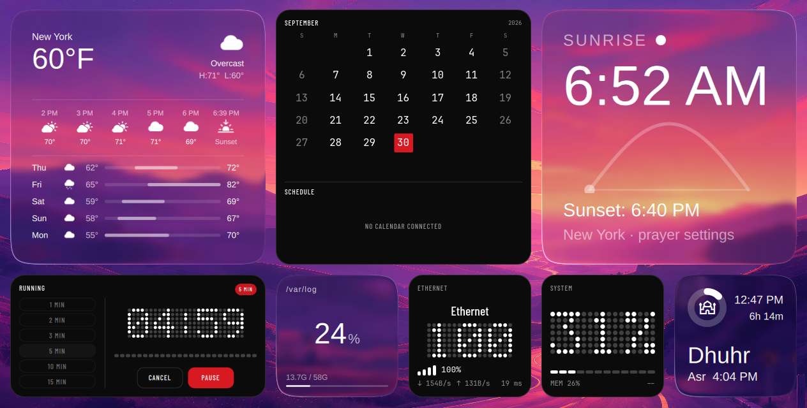
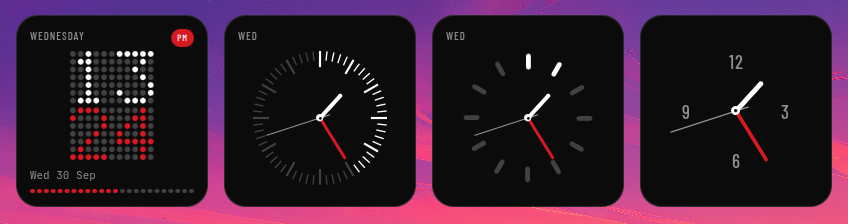
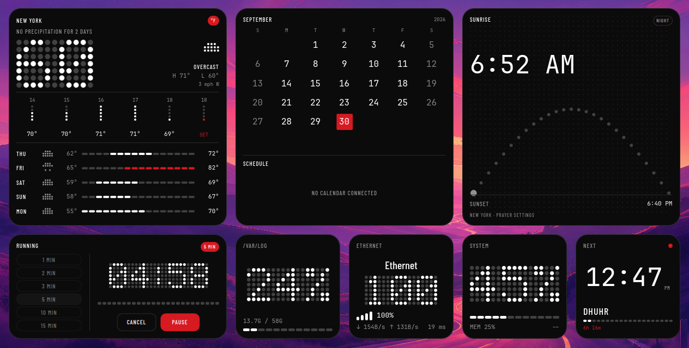
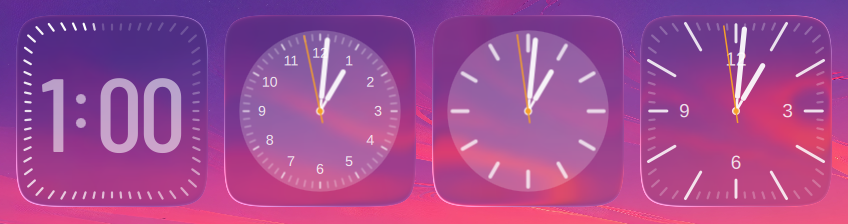
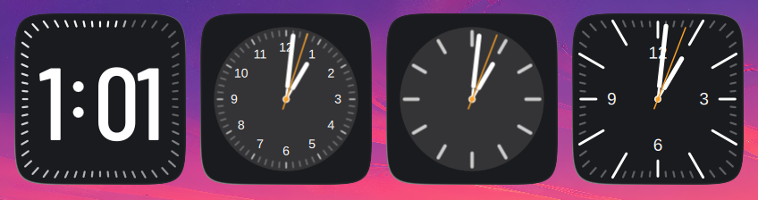
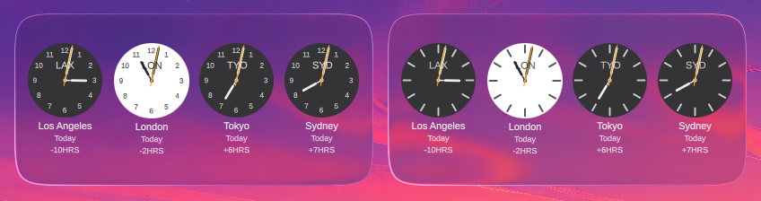
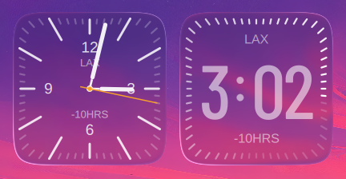
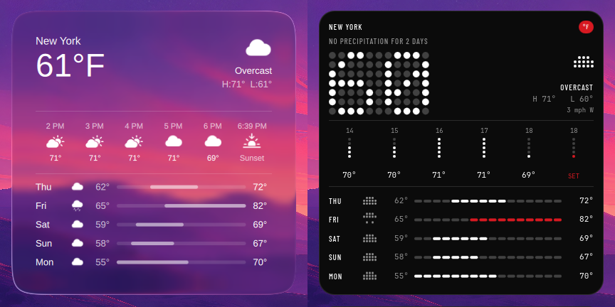
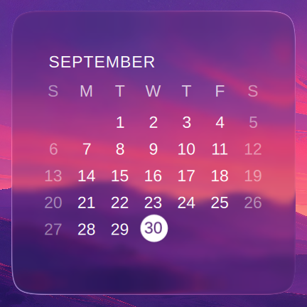
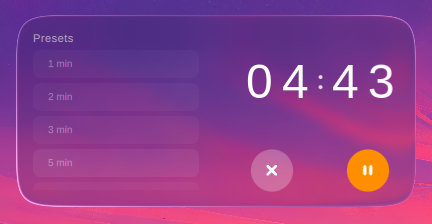

# Nothing Glass

<p align="center">
  <a href="https://ko-fi.com/t1nk33r">
    
  </a>
</p>

Desktop widgets for [Omarchy](https://omarchy.org), in two styles.

**Liquid Glass** tiles refract your real wallpaper through a shader.
**Nothing** tiles are matte black, dot-matrix type and a single red accent.
Every widget is drawn both ways, and each tile picks its own style.



- 24 widget types: clocks, world clocks, weather, calendar, timer, now playing,
  prayer times, sunrise, Tailscale, system, battery, network, storage, photos,
  and usage tiles for Claude and DeepSeek
- Three sizes on a grid: 192×192, 400×192 and 400×400
- Configure a single tile with a right-click, or the whole plugin from the bar
- Everything is scriptable over `omarchy-shell`

It runs on **Omarchy 4.x with Quickshell 0.3.1**, on Hyprland. It targets
nothing else.

## Install

```bash
omarchy plugin add https://github.com/t1nk333r/t1nk33r.nothing-glass.git --enable
omarchy-restart-shell
```

Then click the Nothing Glass icon in the bar and pick a widget.

Optional extras: install the `tailscale` CLI for the Tailscale tiles and
`libnotify` for the timer's notification. Nothing else is required.

**Update** with `omarchy plugin update t1nk33r.nothing-glass`, then
`omarchy-restart-shell`.

**Remove** with `omarchy plugin remove t1nk33r.nothing-glass`. What happens to
the folder depends on how it got there:

- an install made by `plugin add` is a git checkout, so it is deleted
- a plain copied folder is moved aside to `.t1nk33r.nothing-glass.bak.<time>`
- a symlink is unlinked, and the folder it points at is left alone

To keep a checkout, run `omarchy plugin disable t1nk33r.nothing-glass` and move
the folder out yourself. None of these touch your widgets
(`~/.config/omarchy/nothing-glass.json`) or your settings
(`~/.config/omarchy/nothing-glass-options.json`). Removing the plugin does take
its icon out of the bar, and adding it back puts the icon in the default spot.

## Styles

### Nothing




Matte surfaces, dot-matrix numerals, and one accent colour (`#D71921` unless
you change it). Turn on **Follow the Omarchy theme** and the tiles take their
surface, ink and accent from your theme instead. **Card opacity** and **Frost**
sit beside it in the Appearance pane.

### Liquid Glass




A shader crops the wallpaper behind each tile, blurs it, and bends it through a
rounded squircle edge with a little colour fringing and a specular highlight.
There are four modes: Glass, Solid, and a theme-following version of each. The
radius, roundness, refraction, blur, tint and highlight can all be tuned.

### Choosing a style

A tile uses its own style if it has one, otherwise its category's, otherwise
the plugin default. Right-click a tile to set its own. Set a category or the
default from the Appearance pane in the widget browser.

## Widgets

### World clocks




Up to four cities per tile, with correct daylight saving and half-hour offsets.

### Weather



Current conditions, the next few hours and the week ahead. The tile uses the
same location as Omarchy's own weather (`omarchy-weather-location --set`) or
falls back to your IP. Any single tile can be pinned to another city.

### Calendar



A month grid with today highlighted. Stretch the tile wide to get an events
panel. Events come from [`khal`](https://github.com/pimutils/khal) when it is
installed, or from `~/.local/state/omarchy/calendar-events.json`, which
[omarchy-calendar](https://github.com/tmn73/omarchy-calendar) and similar sync
scripts write. With neither, the Liquid Glass tile shows where to point one,
and the Nothing tile simply says *No calendar connected*.

### Timer



Presets, a scroll wheel for custom times, and a notification when it ends. It
keeps time correctly across suspend.

### And the rest

- **Now playing** controls any MPRIS player: music, podcasts or video.
- **Prayer times** are calculated offline.
- **Sunrise** draws the day as an arc, for your prayer location, Omarchy's
  weather location, or coordinates you enter.
- **Tailscale** maps your tailnet. Hover a node for its path, or click it to ping.
- **System**, **battery**, **network** and **storage** cover the machine.
- **Photos** shows a slideshow from a folder you choose.
- **Claude** and **DeepSeek** show usage and balance, if you use them.
- **Codeburn** shows coding-agent spend from the local `codeburn` cache. Its
  refresh button runs the `codeburn` CLI.
- **Media server** shows the status feed an omarr install writes locally.

## Using it

- **Add** a widget: left-click the bar icon to open the widget browser.
- **Move** a tile: drag it with the right mouse button.
- **Resize** a tile: drag its bottom-right corner.
- **Configure** a tile: right-click it.
- **Manage** every tile: right-click the bar icon for the control panel.

Every action is also available from a script:

```bash
omarchy-shell t1nk33r.nothing-glass listTypes
omarchy-shell t1nk33r.nothing-glass add weather ''          # '' = the screen you're on
omarchy-shell t1nk33r.nothing-glass set weather-1 location '"Tokyo"'
omarchy-shell t1nk33r.nothing-glass option widgetStyle nothing
omarchy-shell t1nk33r.nothing-glass launcher ''             # open the widget browser
```

If the bar icon gets hidden inside a drawer, the last command still opens the
browser. To bind it to a key, add this to `~/.config/hypr/bindings.lua` and run
`hyprctl reload`:

```lua
o.bind("SUPER + SHIFT + U", "Nothing Glass widgets",
  "omarchy-shell t1nk33r.nothing-glass launcher ''")
```

## Network and privacy

Most tiles read only your own machine. These are the ones that can go online:

- **Weather** fetches forecasts from `api.open-meteo.com` and looks up city
  names at `geocoding-api.open-meteo.com`. If no location is set anywhere, it
  asks `wttr.in` where your IP address is.
- **Network** sends one ping to `1.1.1.1` when the tile appears, when your
  connection changes, and when you click its latency figure.
- **Tailscale** pings a node on your own tailnet when you click it.
- **Sunrise** can ask GeoClue for your position, but only if you turn on
  *Ask GeoClue for the location*. It is off by default: Omarchy runs no
  GeoClue agent, so the request is made under Firefox's app identity, and if
  a network location provider is configured, nearby Wi-Fi networks may be
  sent to it.
- **Now playing** shows the cover art your music player hands it. When the
  player gives a web address rather than a local file, as streaming players
  often do, the tile downloads the image from that address. The player picks
  the host, not this plugin. Downloads are HTTPS only, including redirects (at
  most three). They are capped at 4 MiB and 10 seconds, and plain `http://`
  and other schemes are refused. The copy lives in a private directory under
  `$XDG_RUNTIME_DIR` and is deleted when the tile goes away.

The hosts named above are fixed. The others are chosen by you or your
software, not this plugin: cover-art addresses come from the player, tailnet
nodes are yours, and a GeoClue provider is whatever `/etc/geoclue/geoclue.conf`
names. The weather lookups send your coordinates or city to open-meteo, and
the IP lookup reveals your address to `wttr.in`; set a location to skip the
IP lookup.

## Troubleshooting

Check the log first:

```bash
journalctl --user -t omarchy-shell | grep -i nothing-glass
```

**The icon is missing from the bar.** Drag *Nothing Glass* back into a section
under *Settings → Bar*. Your widgets keep working without it, and
`omarchy-shell t1nk33r.nothing-glass launcher ''` still opens the browser.

**A widget is listed but not on screen.** It may belong to a monitor that is no
longer connected. Add it again on the screen you're using:
`omarchy-shell t1nk33r.nothing-glass add <type> ''`.

**Your widgets vanished after an edit.** If the widget file stops parsing, the
plugin keeps the old one as `~/.config/omarchy/nothing-glass.json.bak`. Copy
back the entries you need.

**A tile has no glass effect.** The shader failed to load. The log names the
file.

**An animated wallpaper doesn't move behind the glass.** The glass is a still
capture of the wallpaper, refreshed whenever a tile moves.

Use `omarchy-restart-shell` to restart the shell, never
`omarchy-refresh-shell`, which resets your bar layout.

## Contributing

The repository is the plugin. There is no build step and no symlinks, so a
clone is exactly what gets installed.

```bash
bash tests/run.sh             # consistency checks and behaviour tests
bash tests/sweep-widgets.sh   # renders every widget in both styles
qs -n -p glass-dev.qml        # run the widgets without installing
```

`AGENTS.md` describes the layout and conventions, and `PORTING.md` records the
engineering decisions. Issues and pull requests are welcome.

## Credits

The Liquid Glass widgets started as
[liquidglass-kde-widgets](https://github.com/jaxparrow07/liquidglass-kde-widgets),
Jack Faith's macOS-style widgets for KDE Plasma, with contributions from its
community. This project ports them to Omarchy and adds the Nothing style, and
it keeps the upstream licence.

- Code: [GPL-3.0](LICENSE)
- Fonts: two Barlow Condensed faces under OFL-1.1 ([fonts/LICENSES.md](fonts/LICENSES.md))
- Prayer-time engine: a vendored MIT port ([components/prayers/](components/prayers/))

Not affiliated with Apple Inc., Nothing Technology Ltd., or Omarchy.
